# larry-sort
A javascript implementation for the Larry Sorting algorithm

# Weird name?
Yes - I thought of naming it grid sort. But I like larry sort, because it has my name 

# How does it work?
If you have an array of numbers of size m like this:

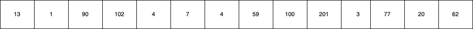

You can put the numbers in a grid of size 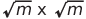 like this:

&nbsp;&nbsp;&nbsp;&nbsp;&nbsp;&nbsp;&nbsp;&nbsp;&nbsp;&nbsp;&nbsp;&nbsp;&nbsp;&nbsp;&nbsp;&nbsp;&nbsp;&nbsp;&nbsp;&nbsp;&nbsp;&nbsp;&nbsp;&nbsp;&nbsp;&nbsp;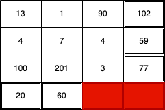

## Step 1

If you sort all even numbered rows in ascending order and all odd numbered rows in descending order like so:

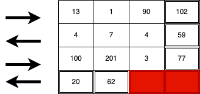

You will end up with this:

&nbsp;&nbsp;&nbsp;&nbsp;&nbsp;&nbsp;&nbsp;&nbsp;&nbsp;&nbsp;&nbsp;&nbsp;&nbsp;&nbsp;&nbsp;&nbsp;&nbsp;&nbsp;&nbsp;&nbsp;&nbsp;&nbsp;&nbsp;&nbsp;&nbsp;&nbsp;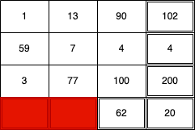

## Step 2

Next, sort all the columns in ascending order like this: 

&nbsp;&nbsp;&nbsp;&nbsp;&nbsp;&nbsp;&nbsp;&nbsp;&nbsp;&nbsp;&nbsp;&nbsp;&nbsp;&nbsp;&nbsp;&nbsp;&nbsp;&nbsp;&nbsp;&nbsp;&nbsp;&nbsp;&nbsp;&nbsp;&nbsp;&nbsp;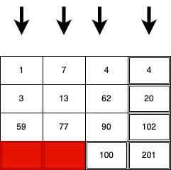

## Repeat

Repeat the above steps for atleast 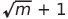  times:  

1.  &nbsp;&nbsp;&nbsp;&nbsp;&nbsp;&nbsp;&nbsp;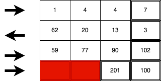 

2.  &nbsp;&nbsp;&nbsp;&nbsp;&nbsp;&nbsp;&nbsp;&nbsp;&nbsp;&nbsp;&nbsp;&nbsp;&nbsp;&nbsp;&nbsp;&nbsp;&nbsp;&nbsp;&nbsp;&nbsp;&nbsp;&nbsp;&nbsp;&nbsp;&nbsp;&nbsp;&nbsp;&nbsp;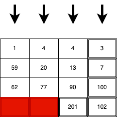  

3.  &nbsp;&nbsp;&nbsp;&nbsp;&nbsp;&nbsp;&nbsp;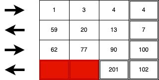  

## Walk the grid 
Now walk the grid from left to right for even numbered rows and right to left for odd numbered rows like so:

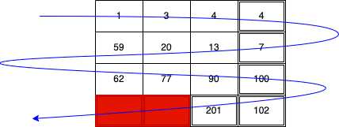 

You will end up with your sorted array:

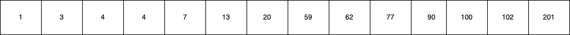 

# Installation
You can test the implementation of this algorithm by installing this package via npm or yarn.
```shell
npm install larry-sort
```

# Usage
```JavaScript
let sort = require('larry-sort');
let unsortedArray = [13,1,90,102,4,7,4,59,100,201,3,77,20,62];
let sortedArray = sort(unsortedArray);
console.log(sortedArray); //[1,3,4,4,7,13,20,59,62,77,90,100,102,201]
```

# BigO stuff
## Space complexity
For an array of size m, the space complexity for this algorithm is **m**
## Time complexity
I'm yet to calculate the time complexity, any help would be appreciated :)


# Future
In the near future, I'm planning to:
1. Calculate the time complexity - ❌
2. Improving the efficiency of the algorithm using memoization - ✅
3. Rows can be sorted in parallel (same applies to columns), The algorithm's efficiency can further be improved by sorting all rows in parallel and then all columns in parallel - ❌
4. If an array is nearly sorted, it would make more sense to add the elements to the grid the same way you walk the grid (instead of adding the default way) to reduce the number of operations and hence improve the worst case scenario for the time complexity - ❌
5. It would be nice to have implementations in other languages - ❌
6. And most importantly, I would love to prove the mathematical hypothesis this algorithm is based on (repeating the steps  times) - ❌

# License
MIT

# Get in touch
You can reach out to me on ngethelawrence@gmail.com